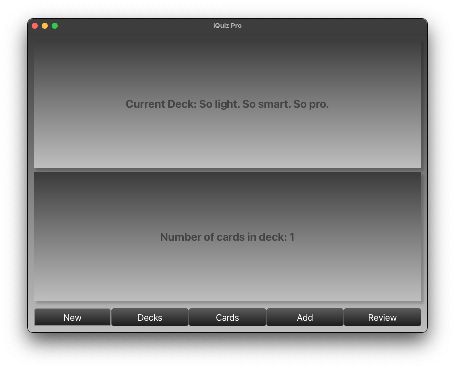

# SmartReviewPad: Enhanced Anki Add-on for Effective Reviewing 📚

SmartReviewPad is an Anki add-on that helps you review your cards more effectively. Now with added features like automatic answer checking and sound effects to improve your learning experience. The add-on is integrated seamlessly with Anki using advanced somftware engineering techniques, such as hooking, overriding, and DOM manipulation, and offers a more interactive and engaging learning experience.

   

---

- [Background](#background)
- [Installation](#installation)
- [Usage](#usage)
- [Updates](#updates)
- [Technical Details](#technical-details)
- [Contributing](#contributing)
- [License](#license)

---

## Background

Anki is a popular flashcard application that uses spaced repetition to help you memorize information more effectively. It's a powerful tool for learning new languages, studying for exams, and improving your memory.

I first started using Anki in my second year of university to help me study for Japanese exams. I found it incredibly useful for memorizing vocabulary and kanji characters. However, I also found it quite tedious to use, especially when reviewing large decks of cards. For more information, see [here](https://apps.ankiweb.net/).

Anki is a great tool for learning and memorizing information. However, it can be tedious to use, especially when reviewing large decks. SmartReviewPad aims to solve this problem by enhancing the Anki experience with new features and improvements.

This repository contains the source code for SmartReviewPad, an Anki add-on that enhances the reviewing experience with features like automatic answer checking and sound effects. The add-on is implemented in Python and extends Anki's internal functionality to provide a more interactive and engaging learning experience. In addition to the add-on, I've also developed iQuiz Pro, a standalone application that allows you to create, edit, and review your Anki decks in a more interactive and engaging way.

The `iQuiz Pro` application is still in development, and is designated to replace the Anki add-on in the future. For now, the Anki add-on is available for download and use, as well as the on-going development of the `iQuiz Pro` application.

The main features of SmartReviewPad include:

- **Interactive Front Side**: Now enhanced with automatic answer checking. Enter your answer on the front side of the card, and SmartReviewPad will automatically verify it against the back side.

- **Automatic Back Side**: The back side of your cards is auto-generated based on your input on the front side.

- **Automatic Review**: Review your cards directly in the editor.

- **Sound Effects**: Celebrate your correct answers with happy asynchronous sound effects. Compatible with Mac Sounds.

- **Dynamic Cards Parsing**: including Close Cards with the `Cloze Detection` feature, including support for MathJax.

  
  
  
   
  <i>SmartReviewPad in action: Automatic answer checking, sound effects, and more.</i>

---

## Installation

To use SmartReviewPad, please make sure you have Anki installed on your machine. You can download Anki from [here](https://apps.ankiweb.net/). SmartReviewPad is compatible with Anki 2.1.0 and later. After installing Anki, follow these steps to install SmartReviewPad:

1. Download the latest version of SmartReviewPad from [here](https://github.com/Dor-sketch/Anki-SmartReviewPad.git).

2. Copy the `SmartReviewPad` folder to your Anki add-ons folder. Navigate to `Tools > Add-ons > View Files...` in Anki to find the add-ons folder.

3. Restart Anki to complete the installation.

  

     
       <i>Anki Add-ons dialog</i>
  

## Usage

1. Open Anki and start reviewing a deck.

2. The add-on will automatically enhance your review session based on the SmartReviewPad features.

3. For more advanced settings, navigate to `Tools > Add-ons > SmartReviewPad > Config`.

## Updates

**NEW: iQuiz Pro 🚀**

iQuiz Pro is a completly standalone application that allows you to create, edit, and review your Anki decks in a more interactive and engaging way. With iQuiz Pro, you can:

- Create and edit your Anki decks with a user-friendly interface.
- Review your cards with interactive features like automatic answer checking and sound effects.
- Track your progress with performance-monitoring tools like the Strike Counter.
- Dont use Anki!
- And much more!

For updates, follow me on [LinkedIn](https://www.linkedin.com/in/dor-pascal/).

---

- **Performance-Monitoring Enhancement**: The new `Strike Counter` now tracks your streak of correct answers, helping you measure your progress more effectively.

- **New Hook**: We've migrated to a new hook for better event handling.

- **New Classes**: Introduced new classes for cleaner code and easier future enhancements.

- **New Logger**: Implemented a dedicated logger for better debugging and event tracking.

- **Cloze Support**: Cloze cards are now supported! 🎉
  - Note: Cloze cards are only partially supported. The add-on will only work with cloze cards that have a single cloze deletion. Multi-cloze cards are not supported at the moment.

  

     
      
      
       
      <i>SmartReviewPad in action: Cloze cards support.</i>
  

  - The add-on will automatically detect cloze cards and enable the relevant features using `Cloze Detection`.

- **MathJax Support**: MathJax is now supported! 🎉
  - Note: To render MathJax, you need Pandoc installed on your machine. For more information, see [here](https://pandoc.org/installing.html).

## Technical Details

SmartReviewPad is implemented as an `Anki add-on`, extending Anki's internal functionality. It uses best practices for code readability and efficiency, including object-oriented programming and asynchronous event handling. 3 main components are used to implement the add-on:

1. `Hooking`: The code uses Anki's `gui_hooks` to append custom functions to existing events. For example, `gui_hooks.reviewer_did_show_question.append(my_update_card_review)` ensures that my_update_card_review gets called when the reviewer shows a question.

2. `Overriding`: The `MyReviewer` class inherits from Anki's Reviewer class. By defining methods in MyReviewer that also exist in the Reviewer class (like `onBridgeCmd`), the new class is overriding the base class's methods. This means when the method is called on an instance of MyReviewer, it will use your new definition instead of the original one.

3. `DOM Manipulation`: The code uses Anki's `webview.eval` function to execute JavaScript code in the reviewer window. This allows you to manipulate the DOM and change the HTML content of the page. For example, `webview.eval("document.getElementById('my-id').innerHTML = 'Hello World!'")` will change the inner HTML of the element with the id `my-id` to `Hello World!`.

## Contributing

If you find a bug or want to contribute to the code, feel free to open an issue or submit a pull request on GitHub.

## License

This project is licensed under the MIT License - see the [LICENSE](LICENSE) file for details.
